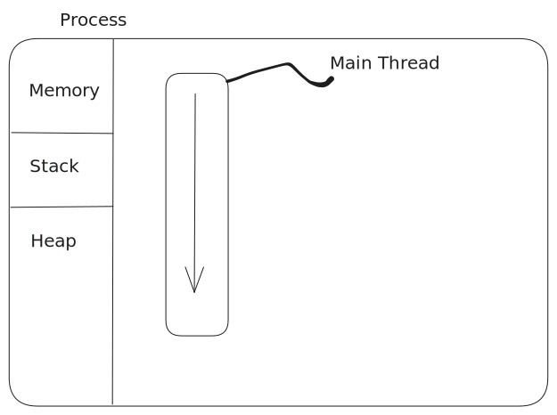
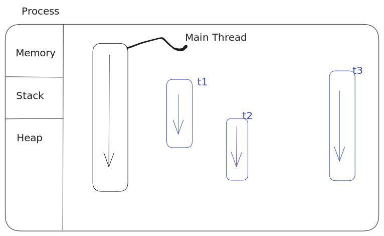

# **Java Concurrency**

---

## **Recap**

* Lambda's
* Streams

---
## **Java Concurrency**
* Threads
* Process
* Using Threads
* Daemon threads
* Thread LifeCycle
---

## **Thread**

- > A thread is a single sequential flow of control within a program.

---

## **Thread**

- Single sequential flow of control
- Allow the program to split into simuntanously running task
- As a metaphor - A worker who is building a wall

---

# **Process**

## Execution -> process

---

## **Process**

- Load program to memory
- Allocate the resources
- Execute the program

---

## **Process**

- > A process is a manifestation of a run state of an application.

---

## **Process**

- Binary instructions loaded into memory
- Get access to resources like memory
- Resource is protected from other processes

---

## **Process vs Threads**

- A process can be single threaded or multi threaded
- A process can spawn multiple threads
- Unlike process, threads in a process can share the same memory and resources

---

## **Process with single thread**



---

## **Process with multiple threads**



---

## **A Java Application**

- A single process (JVM)
- Consists of various threads (Garbage collector, main, etc)
- Application thread - responsible for running the main method

---

## **Threads Creation - The classic way**

- Identify the piece of code, that you want to run in a separate thread
- Create a Runnable implementation for that task

---

## **Threads Creation - The classic way**

```java
public class MyRunnable implements Runnable {

    @Override
    public void run() {
        MyTask.run();
    }
}
```

---

## **Threads Creation - The classic way**

```java
Runnable myRunnable = () -> MyTask.run();
```

---

## **Threads Creation - The classic way**

- Create a thread and pass the runnable to it
- Start the thread

---

## **Threads Creation - The classic way**

```java

Thread myThread = new Thread(myRunnable);

myThread.start();

```

---
## **Demo**
---
## **How this works**

- Thread class is just there, defining meta data for the thread
- JVM calls the underlying OS threading API

---

## **When does a thread end?**

- When the run method returns
- When exception is thrown

---

## **Daemon Threads**

- ## When does the application end?

- When you spawn threads, it ends when all the threads end

---

## **Daemon Threads**

- Daemon threads are threads that end when the main thread ends
- Do not want a thread to extend beyound the lifecycle of the application, create a daemon thread
- Daemon threads are created by calling `setDaemon(true)` on the thread object

---

## **Daemon Threads**

```java
Thread myThread = new Thread(myRunnable);
myThread.setDaemon(true);
myThread.start();
```
---

## **Thread Lifecycles**

- New
- Runnable
- Blocked
- Waiting
- Timed Waiting
- Terminated

---

## **Thread Lifecycles**


---

## **Thread States**

- Running vs Runnable?


---

