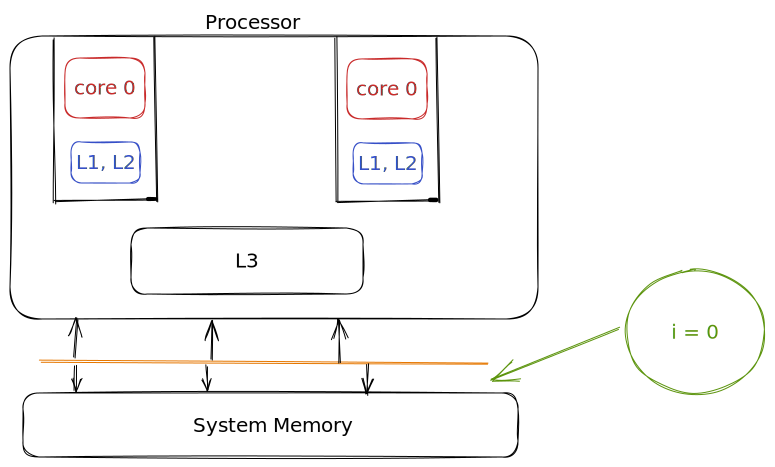

# **Java Concurrency**

---

## **Recap**

* Thread
* Thread vs Process
* Thread Creation
* Daemon Threads
* Thread LifeCycles

---
# **Java Concurrency**

* Joining Threads
* Thread Sleep
* Thread Interruption
* Race Conditions
* Synchronization
* Volatile Keyword
* Thread LifeCycles (Deep Dive)
---

## **Joining Threads**

* Make a thread wait for other thread to complete
* `join()` method on the thread object
* Threads can be interrupted while waiting
* Kind of a sleep, but instead of waiting for some ms, it waits for another thread status to be complete

---

## **Thread Lifecycles**


---


## **Joining Threads**


---

## **Thread Sleep**

* `Thread.sleep()` - puts the thread in waiting or timed waiting state
* Thread can be interrupted while sleeping

---

## **Stopping a thread**

* `Thread.stop()` - deprecated
* There is no way to stop a thread
* Threads can be interrupted while running

---

## **Race Conditions**

* Concurrent programming works seemslessly when there is no shared state

* What if there is a shared state b/w different threads?

---

## **Race Conditions**

- Predictability?



---

## **Synchronization - A Solution**

* Make sure two threads don't simultaneously access a critical data element
* Lock and Key Model
* Locking the critical section and thread Safety

---

## **Synchronization - A Solution**

```java
public void increment() {

    isolateThis {
        this.increment++;
    }
}

```
---

## **Locking the declarative way**

```java
    public void increment() {

        synchronized(this) {
            this.increment++;
        }
    }
```

---

## **Locking the declarative way**

- Syncrhonizing the whole method

```java
    public synchronized void increment() {

            this.increment++;
    }
```

---

## **What synchronization Achieves?**

* Mutual Exclusion or Mutex
* Visibility

---

## **What synchronization Achieves - Visibility**

* Value is read from memory before block execution
* Value is written to memory after block execution

---

## **Structured Locking**

* Block structure using `synchronized` keyword
* Acquiring and releasing locks are implicit
* Exception causing control to exit: lock auto-released

---

## **Problems with Mutex**

* Performance
* Synchronize the bare minimum code necessary
* Choose the right object for the lock
* Extreme synchronization - the serial code

---

## **Problems with Mutex**

- Liveness - State of general activity and motion

---

## **What can cause Liveness Issues**

* Deadlock
* Livelock
* Starvation

---

## **Problem with Mutex - Deadlock**

* Multiple threads are waiting for other threads
* The dependency graph is cyclic

---

## **Problem with Mutex - Deadlock**

```java
synchronized (objRef1) {
    synchronized (objRef2) {
        // do something
    }
}
```

```java
synchronized (objRef2) {
    synchronized (objRef1) {
        // do something
    }
}
```

---

## **Problem with Mutex - Livelock**

* A "smarter" deadlock
* Try to get lock 1
* Try to get lock 2
* If lock 2 not acquired in x ms, release lock 1
* Try again after sometime

---

## **Problem with Mutex - Starvation**

* A thread is ready to run but is never given a chance

---

## **The volatile keyword**

* Volatile keyword is used to make sure, that the value of a variable is read from the memory and written to the memory and not from the cache

* Use `volatile`, when all you care about is visibility

---

## **The volatile keyword**

```java
public class Foo {
    private volatile int value;
}
```
