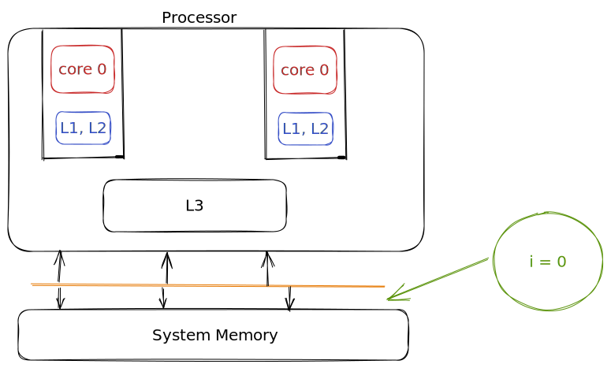

# **Java Concurrency**

---

## **Agenda**

* Threads
* Process
* Using threads
* Daemon threads
* Life cycle and threads states
* Sleeping, joining and interrupting threads

---
## **Agenda**

* Race conditions
* Synchronization
* Monitors and structured locking
* The volatile keyword
* Thread local

---

## **Agenda**

* Advanced concurrency APIs
* Unstructured locks
* Executor service
* Thread pool types
* Callables and Future
* Semaphores
* Fork Join framework
* *Virtual Thread*

---
## **Thread**

* > A thread is a single sequential flow of control within a program.

---
## **Thread**

* Single sequential flow of control
* Allow the program to split into simuntanously running task
* As a metaphor - A worker who is building a wall

---
# **Process**

## Execution -> process

---

## **Process**
* Load program to memory
* Allocate the resources
* Execute the program
---

## **Process**

* > A process is a manifestation of a run state of an application.

---
## **Process**

* Binary instructions loaded into memory
* Get access to resources like memory
* Resource is protected from other processes

---

## **Process vs Threads**

* A process can be single threaded or multi threaded
* A process can spawn multiple threads
* Unlike process, threads in a process can share the same memory and resources

---
## **Process with single thread**


---

## **Process with multiple threads**


---

## **A Java Application**

* A single process (JVM)
* Consists of various threads (Garbage collector, main, etc)
* Application thread - responsible for running the main method

---

## **Threads Creation - The classic way**

* Identify the piece of code, that you want to run in a separate thread
* Create a Runnable implementation for that task
---

## **Threads Creation - The classic way**

```java
public class MyRunnable implements Runnable {
    
    @Override
    public void run() {
        MyTask.run();
    }
}
```
---

## **Threads Creation - The classic way**

```java
Runnable myRunnable = () -> MyTask.run();
```

---

## **Threads Creation - The classic way**

* Create a thread and pass the runnable to it
* Start the thread

---

## **Threads Creation - The classic way**

```java

Thread myThread = new Thread(myRunnable);

myThread.start();

```
---

## **How this works**

* Thread class is just there, defining meta data for the thread
* JVM calls the underlying OS threading API

---
## **When does a thread end?**

* When the run method returns
* When exception is thrown

---
## **Daemon Threads**

* ## When does the application end?

* When you spawn threads, it ends when all the threads end

---

## **Daemon Threads**

* Daemon threads are threads that end when the main thread ends
* Do not want a thread to extend beyound the lifecycle of the application, create a daemon thread
* Daemon threads are created by calling `setDaemon(true)` on the thread object

---
## **Daemon Threads**
```java
Thread myThread = new Thread(myRunnable);
myThread.setDaemon(true);
myThread.start();
```

---

## **Thread Lifecycles**
* New
* Runnable
* Blocked
* Waiting
* Timed Waiting
* Terminated
---

## **Thread Lifecycles**


---

## **Thread States**

* Running vs Runnable?


---

## **Joining Threads**
* Make a thread wait for other thread to complete
* `join()` method on the thread object
* Threads can be interrupted while waiting
* Kind of a sleep, but instead of waiting for some ms, it waits for another thread status to be complete

---

## **Joining Threads**


---

## **Thread Sleep**

* `Thread.sleep()` - puts the thread in waiting or timed waiting state
* Thread can be interrupted while sleeping

---

## **Stopping a thread**
* `Thread.stop()` - deprecated
* There is no way to stop a thread
* Threads can be interrupted while running

---

## **Race Conditions**
* Concurrent programming works seemslessly when there is no shared state

* What if there is a shared state b/w different threads?

---

## **Race Conditions**

* Predictability?



---

## **Synchronization - A Solution**

* Make sure two threads don't simultaneously access a critical data element
* Lock and Key Model
* Locking the critical section and thread Safety

---
## **Synchronization - A Solution**

```java
public void increment() {

    isolateThis {
        this.increment++;
    }
}

```
---
## **Locking the declarative way**
    
```java
    public void increment() {

        synchronized(this) {
            this.increment++;
        }
    }
```

---
## **Locking the declarative way**
* Syncrhonizing the whole method

```java
    public synchronized void increment() {

            this.increment++;        
    }
```

---
## **What synchronization Achieves?**

* Mutual Exclusion or Mutex
* Visibility

---

## **What synchronization Achieves - Visibility**
* Value is read from memory before block execution
* Value is written to memory after block execution

---
## **Structured Locking**
* Block structure using `synchronized` keyword
* Acquiring and releasing locks are implicit
* Exception causing control to exit: lock auto-released
---

## **Problems with Mutex**
* Performance
* Synchronize the bare minimum code necessary
* Choose the right object for the lock
* Extreme synchronization - the serial code
---

## **Problems with Mutex**

* Liveness - State of general activity and motion

---
## **What can cause Liveness Issues**

* Deadlock
* Livelock
* Starvation

---
## **Problem with Mutex - Deadlock**
* Multiple threads are waiting for other threads
* The dependency graph is cyclic

---

## **Problem with Mutex - Deadlock**
```java
synchronized (objRef1) {
    synchronized (objRef2) {
        // do something
    }
}
```

```java
synchronized (objRef2) {
    synchronized (objRef1) {
        // do something
    }
}
```

---

## **Problem with Mutex - Livelock**
* A "smarter" deadlock
* Try to get lock 1
* Try to get lock 2
* If lock 2 not acquired in x ms, release lock 1
* Try again after sometime

---

## **Problem with Mutex - Starvation**

* A thread is ready to run but is never given a chance


---

## **The volatile keyword**

* Volatile keyword is used to make sure, that the value of a variable is read from the memory and written to the memory and not from the cache

* Use `volatile`, when all you care about is visibility

---

## **The volatile keyword**

```java
public class Foo {
    private volatile int value;
}
```
---
